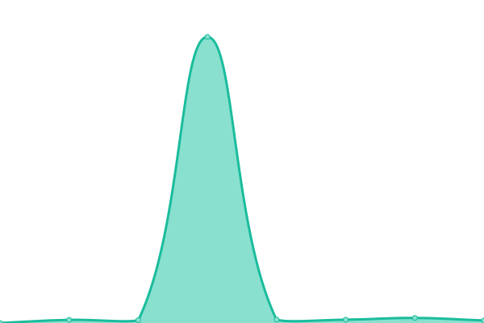

# [📈 Live Status](https://status.crazi.solutions): <!--live status--> **🟧 Partial outage**

This repository contains the open-source uptime monitor and status page for [Upptime](https://upptime.js.org), powered by [Upptime](https://github.com/upptime/upptime).

With [Upptime](https://upptime.js.org), you can get your own unlimited and free uptime monitor and status page, powered entirely by a GitHub repository. We use [Issues](https://github.com/upptime/upptime/issues) as incident reports, [Actions](https://github.com/ArtemZhigarev/uptime/actions) as uptime monitors, and [Pages](https://status.crazi.solutions) for the status page.

<!--start: status pages-->
<!-- This summary is generated by Upptime (https://github.com/upptime/upptime) -->
<!-- Do not edit this manually, your changes will be overwritten -->
<!-- prettier-ignore -->
| URL | Status | History | Response Time | Uptime |
| --- | ------ | ------- | ------------- | ------ |
|  [CRM](https://crm.crazisolutions.dev) | 🟩 Up | [crm.yml](https://github.com/ArtemZhigarev/uptime/commits/HEAD/history/crm.yml) | 

 739ms
     
 | 

<a href="https://status.crazi.solutions/history/crm">89.32%</a>
    

|  [Development Server](https://crazisolutions.dev) | 🟩 Up | [development-server.yml](https://github.com/ArtemZhigarev/uptime/commits/HEAD/history/development-server.yml) | 

 398ms
     
 | 

<a href="https://status.crazi.solutions/history/development-server">89.33%</a>
    

|  [Production Server](https://crazisolutions.live) | 🟥 Down | [production-server.yml](https://github.com/ArtemZhigarev/uptime/commits/HEAD/history/production-server.yml) | 

 0ms
     
 | 

<a href="https://status.crazi.solutions/history/production-server">0.00%</a>
    

|  [Appetizr Website (Production)](https://appetizr.fr) | 🟥 Down | [appetizr-website-production.yml](https://github.com/ArtemZhigarev/uptime/commits/HEAD/history/appetizr-website-production.yml) | 

 642ms
     
 | 

<a href="https://status.crazi.solutions/history/appetizr-website-production">0.00%</a>
    

|  [Appetizr Website (Development)](https://dev.appetizr.fr) | 🟩 Up | [appetizr-website-development.yml](https://github.com/ArtemZhigarev/uptime/commits/HEAD/history/appetizr-website-development.yml) | 

 876ms
     
 | 

<a href="https://status.crazi.solutions/history/appetizr-website-development">89.34%</a>
    

|  [Appetizr CRM](https://crm.appetizr.fr) | 🟩 Up | [appetizr-crm.yml](https://github.com/ArtemZhigarev/uptime/commits/HEAD/history/appetizr-crm.yml) | 

 1045ms
     
 | 

<a href="https://status.crazi.solutions/history/appetizr-crm">89.34%</a>
    

|  [Appetizr Cloud](https://cloud.appetizr.fr) | 🟥 Down | [appetizr-cloud.yml](https://github.com/ArtemZhigarev/uptime/commits/HEAD/history/appetizr-cloud.yml) | 

 704ms
     
 | 

<a href="https://status.crazi.solutions/history/appetizr-cloud">0.00%</a>
    

|  [Appetizr Login System (Google Auth and OTP)](https://google.com) | 🟩 Up | [appetizr-login-system-google-auth-and-otp.yml](https://github.com/ArtemZhigarev/uptime/commits/HEAD/history/appetizr-login-system-google-auth-and-otp.yml) | 

 358ms
     
 | 

<a href="https://status.crazi.solutions/history/appetizr-login-system-google-auth-and-otp">100.00%</a>
    

<!--end: status pages-->

[**Visit our status website →**](https://status.crazi.solutions)

## 📄 License

- Powered by: [Upptime](https://github.com/upptime/upptime)
- Code: [MIT](./LICENSE) © [Upptime](https://upptime.js.org)
- Data in the `./history` directory: [Open Database License](https://opendatacommons.org/licenses/odbl/1-0/)
